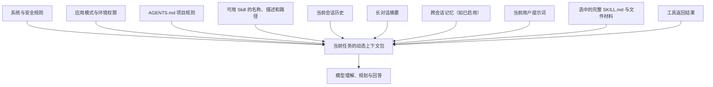
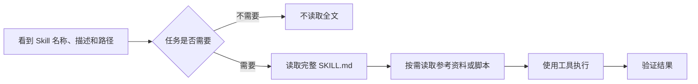
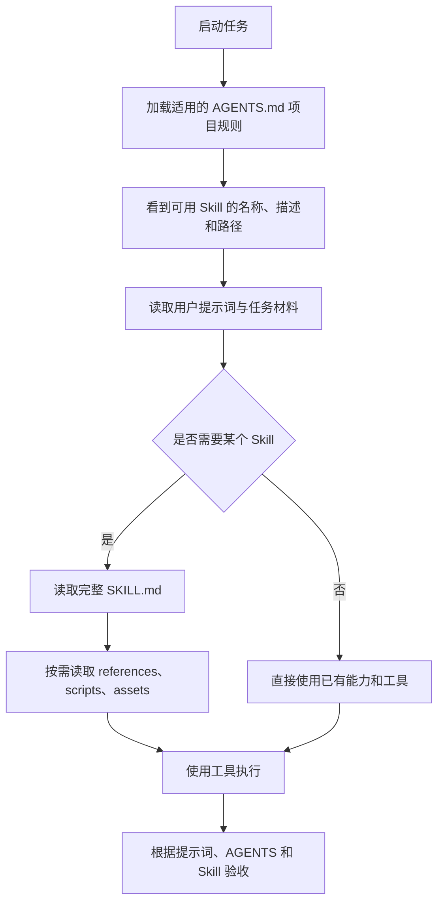

# Skill 与 AGENTS 如何进入 AI 上下文

## 本节课的位置

这一节建议放在“为什么大模型需要提示词”之后、“需求商讨”之前。


学员不需要马上学会编写 Skill，但需要先认识、会调用、会判断它有没有被正确使用。

## 一、先认识 AI 的工作台

可以继续使用“新员工入职”的比喻：

| AI 概念 | 新员工比喻 | 主要作用 |
|---|---|---|
| 大模型 | 员工的大脑 | 理解、推理和生成内容 |
| 提示词 | 本次任务单 | 告诉 AI 这次要做什么 |
| 上下文 | 当前放在桌上的资料 | 告诉 AI 根据什么工作 |
| Skill | 岗位 SOP、专业操作手册 | 告诉 AI 这类任务怎样做 |
| `AGENTS.md` | 项目员工手册 | 告诉 AI 这个项目长期遵守什么规则 |
| Tool | 软件、设备和双手 | 真正读取、修改或生成内容 |
| Environment | 办公室和工作台 | 决定文件在哪里、可以使用什么 |
| Permission | 门禁卡和操作权限 | 决定哪些内容可以读取、修改或发送 |

> [!important] 最关键的区别
> 提示词解决“这一次做什么”，Skill 解决“这一类任务怎样做”，`AGENTS.md` 解决“在这个项目里长期遵守什么”。

## 二、什么是上下文

上下文可以理解为：**AI 在当前任务中能够看到并用于判断的信息集合。**

它可能包括：

- 当前用户的提示词；
- 前面的对话和已经确认的决定；
- 上传或读取的文件；
- 当前工作目录和环境信息；
- 已经加载的项目规则；
- 被选中的 Skill 指令；
- 工具执行后返回的结果。

上下文不是无限的。内容太多时，重要信息可能被大量无关文字淹没。因此，Codex 不会在一开始就把所有 Skill 的全部内容都塞进上下文，而是采用逐步加载。

> [!note] 上下文不等于永久记忆
> Skill 和 `AGENTS.md` 被加载后，会影响当前任务或当前运行中的工作，但不能把它们简单理解为模型永久学会了这些内容。

## 三、完整的 AI 上下文栈

日常说的“提示词”通常指用户在输入框中写下的那段话。但从大模型实际完成任务的角度看，它接收到的并不只有这一句话，而是一份由多种信息共同组成的**动态上下文包**。

> [!important] 教学表达
> 用户提示词只是整个上下文中的一层。AI 的回答还会受到平台规则、项目规则、对话历史、Skill、文件材料、环境权限和工具结果的共同影响。

### 可以把上下文分成 10 层

| 层次 | 主要内容 | 什么时候进入 | 作用 |
|---|---|---|---|
| 1. 系统与安全规则 | 产品边界、安全要求、指令优先级 | 会话开始前 | 规定最基础的行为边界 |
| 2. 应用与运行模式 | 当前使用的 Codex 表面、权限模式和工作方式 | 会话或任务开始时 | 决定可以使用哪些能力 |
| 3. `AGENTS.md` | 全局和项目长期规则 | 开始工作前自动加载 | 告诉 AI 在这个项目中长期怎样做 |
| 4. Skill 精简目录 | Skill 名称、描述和路径 | 初始上下文 | 让 AI 知道有哪些专业流程可选 |
| 5. 环境信息 | 当前目录、日期、系统、可写位置、可用工具 | 任务开始时 | 告诉 AI 在哪里工作、能做什么 |
| 6. 会话历史 | 当前对话中的用户要求、回答和已经确认的决定 | 随对话累积 | 保持当前任务连续性 |
| 7. 摘要与记忆 | 长对话摘要、可能启用的跨会话记忆 | 需要时或启用时 | 在有限上下文中保留有用信息 |
| 8. 当前用户提示词 | 这一次的目标、材料、输出和限制 | 当前轮用户提交时 | 告诉 AI 现在具体做什么 |
| 9. 完整 Skill 与文件材料 | 被选中的 `SKILL.md`、参考资料、上传文件 | 任务匹配或读取文件时 | 提供专业流程和事实依据 |
| 10. 工具执行结果 | 文件内容、搜索结果、命令输出、生成状态 | 执行过程中动态加入 | 让 AI 根据真实结果继续判断 |

这 10 层不是一份固定不变的长文，也不表示它们永远按照表格顺序简单拼接。它们描述的是 AI 工作时可能使用的主要信息来源。

### 一张图理解整体结构



### 静态内容与动态内容

| 类型 | 示例 | 特点 |
|---|---|---|
| 相对稳定 | 系统规则、`AGENTS.md`、环境权限 | 通常在任务开始前已经存在 |
| 按需加载 | 完整 Skill、参考资料、项目文件 | 任务需要时才读取 |
| 持续变化 | 当前对话、用户新要求、工具结果 | 每一轮都可能增加或更新 |
| 可能出现 | 长对话摘要、跨会话记忆 | 取决于上下文长度、产品能力和设置 |

## 四、当前对话、摘要与跨会话记忆

这三个概念容易被混在一起，建议单独讲解。

### 1. 当前对话历史

当前对话历史是同一个任务中已经发生的交流，包括：

- 用户之前提出的要求；
- AI 已经给出的方案；
- 双方确认过的决定；
- 已经完成或失败的操作；
- 工具返回的结果；
- 用户后来追加或修改的要求。

它的作用是保持任务连续。例如，用户先确认课程路线，后面只说“把它整理成文档”，AI 可以根据当前对话理解“它”指的是什么。

### 2. 长对话摘要，也叫上下文压缩

上下文窗口有容量限制。当当前对话变得很长时，系统可能把较早的内容压缩成摘要，只保留目标、重要决定、约束、文件和未完成事项。

在 Codex CLI 中，`/compact` 的作用就是总结当前可见对话，释放上下文空间，同时尽量保留关键内容。


> [!warning] 摘要不是逐字原文
> 压缩摘要会保留重点，但可能省略细节。如果某个要求非常重要，应把它写进 `AGENTS.md`、需求文档，或者在当前提示词中重新明确，而不要只依赖旧对话中的一句话。

### 3. 跨会话记忆

如果产品和当前设置启用了 Memories，Codex 可以把过去任务中的部分有用信息整理为记忆，并在未来任务相关时将其加入上下文。

记忆可能包含：

- 稳定的个人偏好；
- 反复出现的工作习惯；
- 常用项目背景；
- 过去任务的摘要或近期输入；
- 对未来任务可能有帮助的经验。

但跨会话记忆有几个边界：

- 它不等于自动读取所有历史会话；
- 它可能没有启用；
- 它只会选择被认为相关的内容；
- 它可能不是任务最新、最完整的事实来源；
- 必须长期遵守的项目规则仍应写进 `AGENTS.md`。

### 4. 另一个会话是否会自动进入当前上下文

一般不要假设另一个独立会话的全文会自动出现在当前任务中。跨会话信息通常需要通过以下方式之一进入：

- 用户在当前对话中重新提供；
- 写入项目文件或 `AGENTS.md`；
- 通过任务继续、分支或交接机制携带；
- 被整理成当前可用的摘要；
- 在 Memories 启用并判断相关时被加入。

### 四者对比

| 信息类型 | 主要解决什么 | 是否长期可靠 | 建议用途 |
|---|---|---|---|
| 当前提示词 | 这一次具体做什么 | 只针对当前任务 | 当前目标、输出、截止时间 |
| 当前对话历史 | 保持本次任务连续 | 随上下文长度变化 | 当前讨论与已经确认的决定 |
| 长对话摘要 | 压缩本次长对话 | 保留重点，不保留全部细节 | 长任务续作 |
| 跨会话记忆 | 帮助回忆过去的相关信息 | 不应作为唯一规则来源 | 偏好、习惯和辅助背景 |
| `AGENTS.md` | 保证项目规则持续生效 | 文件存在时较稳定 | 路径、规范、命令和验收标准 |

> [!tip] 教给小白的简单判断
> 本次才有的要求写进提示词；本次已经讨论的内容保留在当前对话；必须长期遵守的规则写进 `AGENTS.md`；重复的专业方法做成 Skill；过去经验可以由记忆辅助，但不能只靠记忆。

## 五、Skill 是怎么来的

Skill 是为某类任务准备的可复用工作流程。它可以只包含操作说明，也可以附带参考资料、脚本和模板。

典型结构可以理解为：

```text
skill-name/
├── SKILL.md          # 核心说明和执行流程
├── references/       # 需要时读取的参考资料
├── scripts/          # 可以复用的执行脚本
└── assets/           # 模板、图片等资源
```

其中 `SKILL.md` 至少会说明：

- Skill 的名称；
- Skill 的用途和触发范围；
- 执行这类任务时应该遵循的步骤；
- 需要读取哪些资料；
- 应该使用哪些工具；
- 完成后怎样检查。

### Skill 从哪里出现

Codex 可以从多个位置发现 Skill：

- **项目 Skill**：放在项目的 `.agents/skills` 中；
- **个人 Skill**：供当前用户在不同项目中使用；
- **管理员 Skill**：由组织或机器管理员统一提供；
- **系统 Skill**：由 Codex 内置或随产品提供；
- **插件中的 Skill**：跟随插件一起安装和分发。

小白阶段不需要记住所有技术路径，只需要知道：Skill 可以属于某一个项目，也可以在多个项目中复用。

## 六、Codex 怎样读取 Skill

Skill 采用“逐步披露”方式管理上下文，可以分成五步理解。

### 第一步：先看到 Skill 目录

任务开始时，Codex 通常先看到每个可用 Skill 的：

- 名称；
- 简短描述；
- 文件路径。

这相当于先看到图书馆的书名、简介和书架位置，而不是一开始把所有书全文读完。

> [!info] 为什么 Skill 目录要保持精简
> 按官方说明，初始 Skill 列表最多使用上下文窗口的 2%；如果窗口大小未知，则最多使用 8,000 个字符。Skill 太多时会先缩短描述，数量仍然过多时还可能省略部分 Skill；但某个 Skill 一旦被选中，Codex 仍会读取它的完整 `SKILL.md`。

### 第二步：判断是否需要使用

Skill 可以通过两种方式触发：

1. **明确调用**：用户直接指定 Skill；
2. **自动匹配**：任务内容与 Skill 描述相符，Codex 判断应该使用。

例如：

```text
请使用表格 Skill 分析这份销售数据，并生成一个可复核的 Excel 报表。
```

或者只说清楚目标：

```text
请读取这份销售数据，计算门店完成率，生成 Excel，并检查公式和异常值。
```

第二种情况下，Codex可以根据任务与 Skill 描述的匹配情况选择相关 Skill。

### 第三步：读取完整 `SKILL.md`

一旦决定使用某个 Skill，Codex 才会读取完整的 `SKILL.md`，了解它的工作流程和检查要求。

### 第四步：按需要读取附加资料

如果 `SKILL.md` 指向 `references/`、模板、脚本或其他资源，Codex 会根据任务需要继续读取或使用，而不是无条件加载所有附件。

### 第五步：执行并检查

Codex 按照提示词、项目规则和 Skill 流程使用相应工具，最后检查产物。



> [!tip] 为什么不一开始全部读取
> Skill 可能很多，每个 Skill 也可能很长。先读目录、需要时再读全文，可以节省上下文空间，让当前任务的重点更加清楚。

## 七、Skill 进入上下文后发生什么

读取 `SKILL.md` 后，可以把它理解为进入了当前任务的“有效工作上下文”。此时 AI 会同时参考：

1. 用户这次提出的目标；
2. 当前项目的长期规则；
3. Skill 提供的专业流程；
4. 已提供的数据和文件；
5. 工具执行后返回的结果。

但 Skill 不是永久记忆，也不是把模型重新训练了一次。进入新的环境或任务时，仍然要重新发现、选择和读取相应 Skill。

## 八、什么是 `AGENTS.md`

`AGENTS.md` 是给 Codex 使用的项目说明文件，可以理解为“项目员工手册”。它适合记录长期、重复、与项目范围有关的规则。

例如：

- 项目目录结构；
- 重要文件放在哪里；
- 常用运行和检查命令；
- 文件命名规范；
- 课程笔记保存位置；
- 哪些内容不能修改；
- 怎样才算完成任务；
- 完成后需要做哪些验证。

本项目中的实际例子是：

```text
本项目对应的 Obsidian vault：
/Users/joo00der/Library/Mobile Documents/iCloud~md~obsidian/Documents/cz-night-learn-20260713
```

把路径写入项目 `AGENTS.md` 后，后续处理本项目笔记时就不需要每次重新说明保存位置。

## 九、Codex 怎样读取 `AGENTS.md`

`AGENTS.md` 与 Skill 的加载方式不同。Codex 在开始工作前会主动寻找适用的项目规则，不需要先进行 Skill 匹配。

加载顺序可以简化为：


主要规则是：

- 先读取全局范围的规则；
- 再从项目根目录向当前工作目录逐层查找；
- 越接近当前工作目录的规则越具体；
- 更具体的规则可以覆盖较上层的规则；
- 空文件会被忽略；
- 为了控制上下文大小，项目规则有默认的总大小限制。

> [!example] 规则层级
> 公司级规则可以要求所有项目都保护敏感数据；项目根目录规则可以规定统一测试方法；某个子目录的规则可以规定该模块专用的命名和检查方式。

## 十、提示词、Skill 与 `AGENTS.md` 放在哪里

| 内容 | 一般放在哪里 | 什么时候读取 | 适合记录什么 |
|---|---|---|---|
| 提示词 | 当前对话或任务 | 用户提交任务时 | 本次目标、材料、输出和限制 |
| `AGENTS.md` | 全局目录、项目根目录或子目录 | 开始工作前自动加载 | 长期项目规则、路径、命令和验收标准 |
| Skill | Skill 目录中的 `SKILL.md` | 先发现描述，匹配后读取全文 | 某类任务的可复用专业流程 |
| 参考资料 | Skill 的 `references/` 或项目文档 | 任务需要时按需读取 | 详细规范、案例和背景知识 |
| Tool | Codex 可调用的工具系统 | 真正执行操作时 | 读取、写入、搜索、生成和验证 |

### 一条完整的读取路线



## 十一、用本课程任务举例

假设用户提出：

```text
请把“为什么大模型需要提示词”整理为一篇 Obsidian 讲义。
```

整个过程可以这样理解：

1. **提示词**说明本次目标是创建一篇 Obsidian 讲义；
2. **`AGENTS.md`**说明本项目的 Obsidian vault 路径和笔记规范；
3. **Skill 目录**让 Codex 发现 Obsidian Markdown 和 Obsidian CLI 相关 Skill；
4. **完整 Skill**告诉 Codex 怎样使用 frontmatter、wikilink、callout 并验证文件；
5. **Tool**负责读取现有笔记、创建文件和检查结果；
6. **人工验收**确认课程内容、结构和保存位置符合需求。

> [!important] 这不是四选一
> 提示词、`AGENTS.md`、Skill 和 Tool 不是互相替代的关系，而是共同完成任务的不同层次。

## 十二、小白需要掌握到什么程度

### 现在需要会

- [ ] 知道 Skill 是可复用的专业流程；
- [ ] 知道 Codex 会先看 Skill 名称和描述，再决定是否读取全文；
- [ ] 会直接指定 Skill，或者把任务目标描述清楚；
- [ ] 知道 `AGENTS.md` 保存项目长期规则；
- [ ] 能区分提示词、Skill、`AGENTS.md` 和 Tool；
- [ ] 知道加载进上下文不等于永久记忆；
- [ ] 会检查 AI 是否按照 Skill 和项目规则执行。

### 暂时不要求

- 自己编写复杂 `SKILL.md`；
- 编写脚本和自动化工具；
- 配置管理员级 Skill；
- 理解所有上下文窗口参数；
- 开发插件或 MCP 服务。

## 十三、课堂练习

### 练习一：判断应该放在哪里

请判断下面的信息应该写进提示词、`AGENTS.md` 还是 Skill：

| 信息 | 建议位置 |
|---|---|
| 今天要生成一份 5 页销售 PPT | 提示词 |
| 项目所有课程笔记都保存到固定 Obsidian vault | `AGENTS.md` |
| 每次制作 PPT 都要先规划结构、再生成、最后渲染检查 | Skill |
| 本次 PPT 的汇报对象是区域经理 | 提示词 |
| 项目文件统一使用中文名称 | `AGENTS.md` |
| 表格生成后检查公式、空值、格式和图表 | Skill |

### 练习二：观察 Skill 的读取过程

让学员完成一次任务，并观察以下节点：

1. 当前有哪些可用 Skill；
2. 哪个 Skill 与任务匹配；
3. AI 是否说明正在使用该 Skill；
4. Skill 带来了哪些操作步骤；
5. 最终是否完成了 Skill 要求的检查。

## 十四、讲师总结

> [!quote] 一句话总结
> 提示词是任务单，`AGENTS.md` 是项目员工手册，Skill 是岗位 SOP，Tool 是执行工具；它们一起进入 AI 的工作过程，但负责不同层次的问题。

## 官方参考

- [OpenAI：Build skills](https://learn.chatgpt.com/docs/build-skills)
- [OpenAI：Custom instructions with AGENTS.md](https://learn.chatgpt.com/docs/agent-configuration/agents-md)
- [OpenAI：Memories](https://learn.chatgpt.com/docs/customization/memories)
- [OpenAI：Codex CLI slash commands](https://learn.chatgpt.com/docs/developer-commands.md?surface=cli)

## 相关内容

- [[AI办公课/00-课程导航|返回课程导航]]
- [[AI办公课/03-为什么大模型需要提示词|为什么大模型需要提示词]]
- [[AI办公课/02-课程思维导图-AI报表与PPT.canvas|课程思维导图：AI 报表与 PPT]]
