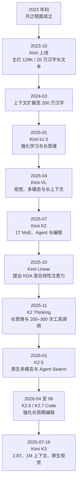
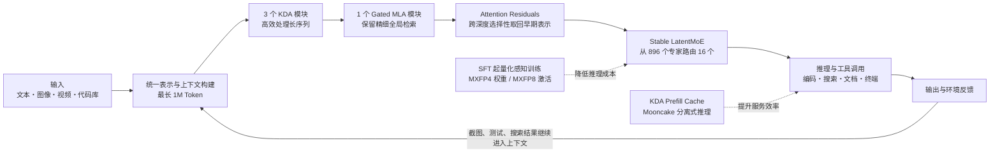

# 国产 Kimi K3 模型调研报告

> [!abstract] 调研结论
> Kimi K3 是北京月之暗面（Moonshot AI）于 **2026 年 7 月 16 日**发布的旗舰大模型。它的核心优势不是单纯“参数更大”，而是把 **2.8 万亿总参数、稀疏 MoE、100 万 Token 上下文、原生视觉、长周期 Agent、Kimi Delta Attention 与 Attention Residuals** 组合成一套面向复杂任务的系统。现有公开结果表明，它在前端开发、长周期编程、深度研究和多模态知识工作上尤其突出；但其完整权重和技术报告截至本报告截稿日尚未发布，部署门槛、服务稳定性和部分厂商自测结果仍需后续验证。

## 1. 调研对象与口径

本文所说的“国产 K3 模型”特指 **Kimi K3**，研发主体为中国北京的月之暗面科技有限公司。月之暗面创立于 2023 年初，团队技术积累包括 Transformer-XL、RoPE、MuonClip、Mooncake 等方向。[月之暗面官方简介](https://www.moonshot.cn/about/)

需要区分三个概念：

- **Kimi**：面向用户的 AI 助手和产品品牌。
- **Kimi K2、K2.5、K2.6、K3**：底层模型系列。
- **Kimi Work、Kimi Code、API**：承载模型能力的工作台、编程代理和开发接口。

> [!warning] “开源”表述需要谨慎
> 月之暗面将 K3 称为“首个开放的 3T 级模型”，但截至 **2026 年 7 月 22 日**，官方承诺的完整权重发布日期是 **7 月 27 日前**，技术报告也尚待发布。因此本文优先使用更严谨的“拟开放权重模型”或“开放模型”，不把尚未落地的权重、许可证和社区部署兼容性视为已完成事实。[Kimi K3 官方技术博客](https://www.kimi.com/blog/kimi-k3)

## 2. 一页速览

| 维度 | Kimi K3 的公开信息 | 实际意义 |
|---|---|---|
| 发布方 | 月之暗面（Moonshot AI，北京） | 国产通用大模型 |
| 发布时间 | 2026-07-16 | 发布仅一周，外部评测仍在积累 |
| 参数规模 | 2.8T 总参数 | 官方称首个达到 3T 级的开放模型 |
| 模型结构 | Stable LatentMoE，每个 Token 有效路由 16/896 个专家 | 用稀疏激活控制超大模型计算量 |
| 注意力结构 | KDA 与 Gated MLA 按 3:1 组合，配合 AttnRes | 同时优化长序列效率和跨层信息流 |
| 上下文窗口 | 1,048,576 Token（约 100 万 Token） | 可处理大型代码库、长文档和长周期轨迹 |
| 多模态 | 原生视觉，官方案例覆盖图像、视频、界面和 CAD | 视觉可进入编程与 Agent 的反馈闭环 |
| 重点能力 | 长周期编程、知识工作、深度研究、推理 | 定位不是普通问答，而是复杂任务执行 |
| 推理精度 | SFT 起采用 MXFP4 权重、MXFP8 激活的量化感知训练 | 降低推理成本并扩大硬件适配范围 |
| 官方 API 价格 | 缓存命中输入 $0.30/MTok；未命中输入 $3/MTok；输出 $15/MTok | 长上下文重复使用时，缓存价值很高 |
| 推荐部署 | 64 张及以上加速卡的超节点 | 私有化部署门槛较高，不是消费级本地模型 |

参数、架构、部署与价格均来自 [Kimi K3 官方技术博客](https://www.kimi.com/blog/kimi-k3) 和 [Kimi API 官方页面](https://platform.kimi.ai/)。

## 3. 发展历史

K3 并非一次孤立的“堆参数”，而是月之暗面从长上下文、强化学习、多模态、Agent 到稀疏架构持续演进的结果。

### 3.1 长文本产品起点：2023—2024

- **2023 年初**：月之暗面成立。
- **2023 年 10 月**：Kimi 智能助手上线，以约 20 万汉字、128K Token 级长上下文形成差异化定位。
- **2024 年 3 月 18 日**：Kimi 宣布支持 200 万汉字无损上下文内测，生成速度较初版提升约 3 倍。长文档阅读、材料汇总和联网搜索成为其产品认知基础。[界面新闻报道](https://www.jiemian.com/article/10934920.html)

### 3.2 推理、多模态与开放模型：2025

- **2025 年 1 月**：Kimi k1.5 技术报告发布，重点探索通过强化学习扩大推理能力。[Kimi k1.5 论文](https://arxiv.org/abs/2501.12599)
- **2025 年 4 月**：Kimi-VL 将视觉理解、多模态推理和长上下文结合起来，为 K3 的原生视觉路线奠定基础。[Kimi-VL 论文](https://arxiv.org/abs/2504.07491)
- **2025 年 7 月 11 日**：Kimi K2 发布。K2 是 1T 总参数、32B 激活参数的 MoE 模型，重点面向编程、工具使用和 Agent 任务。[Kimi K2 官方博客](https://www.kimi.com/blog/kimi-k2)
- **2025 年 10 月**：Kimi Linear 发布，提出 Kimi Delta Attention（KDA），以 3:1 的 KDA/MLA 混合结构降低超长上下文的 KV Cache 压力。[Kimi Linear 论文与代码](https://github.com/MoonshotAI/Kimi-Linear)
- **2025 年 11 月 6 日**：K2 Thinking 发布，把测试时扩展从“更多思考 Token”推进到“更多工具调用步骤”，官方称可连续执行 200—300 次工具调用。[K2 Thinking 官方博客](https://www.kimi.com/blog/kimi-k2-thinking)

### 3.3 Agent 与长周期工程：2026

- **2026 年 1 月 27 日**：K2.5 发布，进一步统一文本与视觉，并加入可动态拆分并行子任务的 Agent Swarm。论文报告其相对单 Agent 基线最高可降低 4.5 倍延迟。[Kimi K2.5 论文](https://arxiv.org/abs/2602.02276)
- **2026 年 4 月 20 日**：K2.6 强化长周期编程、跨工具执行与主动 Agent。[K2.6 官方博客](https://www.kimi.com/blog/kimi-k2-6)
- **2026 年 6 月 12 日**：K2.7 Code 作为编程分支发布并开放权重。[Kimi Code 更新日志](https://www.kimi.com/code/docs/en/kimi-code/whats-new.html)
- **2026 年 7 月 16 日**：K3 发布，将此前的长上下文、KDA、原生视觉、MoE、长思维和 Agent 工程汇合到 2.8T 规模。[Kimi Research 时间线](https://www.kimi.com/en/blog/)

## 4. Kimi K3 的主要优势

### 4.1 3T 级开放模型带来的能力上限

K3 有 2.8 万亿总参数。相较 K2 的 1 万亿参数，其参数容量显著扩大；同时借助 MoE，每个 Token 只路由到 896 个专家中的 16 个，避免在每一步都调用全部参数。官方称，在架构、训练和数据配方共同作用下，K3 相对 K2 的整体 Scaling 效率提升约 **2.5 倍**。

优势不应被简化为“参数越大越聪明”。更准确地说，大规模提供了更高的容量上限，稀疏路由、训练稳定性和后训练质量决定这部分容量能否转化为实际能力。

### 4.2 100 万 Token 上下文适合真正的长任务

长上下文对 K3 的意义不仅是“上传更多文件”，还包括：

- 在一个会话中理解大型代码仓库、Issue、测试日志与终端输出；
- 阅读多份财报、论文、网页和表格后建立交叉证据；
- 保留 Agent 在数百步操作中的目标、约束和中间结果；
- 复用缓存后的长前缀，降低重复输入成本。

这延续了 Kimi 自 2023 年以来的长文本技术路线，也让 K3 更适合“连续工作数小时”的任务，而不是一次性问答。

### 4.3 原生视觉进入编程与知识工作的反馈闭环

K3 不只是“能看图”，而是把视觉作为执行过程的一部分：模型可以生成前端或游戏代码，查看运行截图，再根据视觉结果继续修改；也可处理界面、视频、CAD 和信息图。这个“视觉输入 → 执行 → 截图反馈 → 再修改”的闭环，对 UI 开发、数字内容和办公材料生成很有价值。

### 4.4 长周期编程与 Agent 能力突出

官方案例覆盖 GPU Kernel 优化、编译器开发、芯片设计、游戏开发和科研代码复现，强调模型在较少人工干预下持续调用终端工具、理解大型仓库并修复问题。外部用户偏好评测也给出积极信号：截至 2026 年 7 月 16 日，K3 在 Arena 的 WebDev 榜单以 **1679±17** 暂列第一，领先 Claude Fable 5 和 GPT-5.6 Sol；不过该成绩仍标记为 **Preliminary**。[Arena WebDev 榜单](https://arena.ai/leaderboard/code/webdev?rankBy=labs)

这说明 K3 的优势更接近“工程代理”而非单纯代码补全：它能规划、调用工具、读取反馈并持续迭代。

### 4.5 架构创新兼顾长序列和超深模型

K3 的核心处理流程可概括为：

- **KDA**：线性注意力方向，主要缓解超长上下文的计算和缓存压力。
- **Gated MLA**：每四层中保留一层更精细的全局注意力，补足纯线性注意力可能损失的信息检索能力。
- **Attention Residuals**：不再只让层层结果均匀累加，而是允许深层按需取回早期层表示，改善跨深度信息流。
- **Stable LatentMoE**：以极高稀疏度扩大知识容量，同时通过 Quantile Balancing、Per-Head Muon 等机制维持路由和训练稳定。

### 4.6 开放权重与成本结构有企业吸引力

如果完整权重和许可证如期发布，企业将获得模型审计、私有化部署、行业微调和长期版本锁定的空间。API 侧对缓存命中输入提供 90% 折扣，也契合大代码库、固定资料库和长会话等高重复前缀场景。

但 K3 的“大”也是成本：官方建议 64 张及以上加速卡的超节点部署。对普通团队而言，API 或托管推理通常比自建集群更现实。

## 5. 外部验证与证据强度

| 判断 | 证据 | 可信度与注意事项 |
|---|---|---|
| 2.8T、1M 上下文、原生视觉、16/896 专家 | 官方发布博客；新华社报道 | 基本规格较明确，但完整技术报告待发布 |
| 前端开发能力强 | Arena WebDev 暂列第 1，1679±17 | 独立用户偏好信号；仍为 Preliminary |
| 综合能力进入前沿梯队 | Arena Hard Prompts 暂列第 6，1518±22；Nature 称研究者对其规模与能力印象深刻 | 样本和排名仍会变化，不能等同于所有场景第 6 |
| 已全面超过最强闭源模型 | **不成立** | 月之暗面自己明确承认总体仍落后于 Claude Fable 5 与 GPT-5.6 Sol |
| 可立即自由私有部署 | **截至截稿日不成立** | 完整权重计划 7 月 27 日前发布，许可证和兼容性需以届时仓库为准 |
| 市场需求强 | 发布数日后因需求超过容量暂停新订阅 | 说明关注度高，也暴露初期服务容量问题 |

外部来源：[Arena Hard Prompts](https://arena.ai/leaderboard/text/hard-prompts-english)、[Nature 分析](https://www.nature.com/articles/d41586-026-02281-2)、[AP 关于发布后容量压力的报道](https://apnews.com/article/4c66a2e0f557ce79d3cc2d769c9a6226)、[新华社报道](https://www.news.cn/20260717/cab4891d46844291a1518409e2b11fb7/c.html)。

## 6. 局限与风险

### 6.1 技术披露仍不完整

截至 7 月 22 日，完整技术报告、训练数据细节、激活参数总量、安全评估和完整权重尚未全部公开。官方演示和内部评测可以说明潜力，但不能代替可复现实验。

### 6.2 评测条件并不完全一致

官方表格中的模型可能使用 Kimi Code、Claude Code 或 Codex 等不同 Agent Harness，部分基准还使用不同硬件或第三方成绩。即使分数可比，也不代表模型本体能力被完全隔离比较。应优先关注同任务、同工具、同预算的实测。

### 6.3 超大规模抬高私有部署门槛

2.8T 总参数即便采用低精度和稀疏激活，也需要高带宽互联、大规模显存、专家并行和成熟的推理基础设施。它适合数据中心级部署，不适合普通个人电脑或少量消费级显卡。

### 6.4 官方明确列出的行为问题

- **依赖完整思维历史**：Agent Harness 若未正确回传历史思维内容，或会话中途从其他模型切换到 K3，质量可能明显波动。
- **过度主动**：面对小问题或模糊意图时，模型可能替用户做出意外决定；企业使用时应在系统提示词或 `AGENTS.md` 中收紧权限、边界和审批点。
- **体验仍有差距**：官方承认其总体用户体验与 Claude Fable 5、GPT-5.6 Sol 仍存在可感知差距。

### 6.5 服务容量与供应链问题

发布后短期需求曾使新订阅暂停，说明在线服务仍需扩容。另一方面，官方尚未披露 K3 的训练硬件；对需要国产算力适配、稳定 SLA 或跨区域合规的组织，应单独做 PoC，而不能从“国产模型”直接推导出“已实现全国产软硬件栈”。

## 7. 适用场景与选型建议

| 场景 | 推荐度 | 原因与建议 |
|---|---:|---|
| 大型代码库改造、长周期软件工程 | ★★★★★ | K3 的核心优势场景；建议用 Kimi Code 或经过兼容验证的 Harness |
| 多文档深度研究、财报与论文综合 | ★★★★★ | 1M 上下文、搜索与工具调用适合长证据链任务 |
| 前端、游戏、CAD、视频等视觉驱动开发 | ★★★★★ | 原生视觉可进入生成—截图—修改闭环 |
| PPT、报告、表格等复杂知识工作 | ★★★★☆ | 适合多来源材料和跨工具交付；关键数字仍需人工复核 |
| 企业私有化与行业微调 | ★★★☆☆ | 开放权重有潜力，但应等待权重、许可证与技术报告，并评估 64+ 加速卡成本 |
| 简单问答、短文本润色 | ★★☆☆☆ | 能力过剩且输出成本较高，小模型通常更经济、更快 |
| 高权限全自动操作 | ★★☆☆☆ | 存在过度主动风险，必须设置最小权限、审批点和可回滚机制 |

### 建议的企业验证流程

1. 从真实业务中选取 30—100 个任务，覆盖正常、边界和失败案例。
2. 固定 Agent Harness、工具权限、思考强度、上下文和预算，与现用模型做盲测。
3. 同时测正确率、任务完成率、延迟、Token 成本、人工接管次数和安全违规率。
4. 对长任务重点检查“中途跑偏”“错误继续放大”“过度主动操作”三类问题。
5. 权重发布后，再验证许可证、国内算力适配、量化精度下降和集群吞吐。

## 8. 综合判断

Kimi K3 的战略意义可以概括为三点：

1. **把中国开放模型推进到前沿能力区间**：目前的外部信号表明，它不只是“性价比替代”，而是在部分工程任务上具备领先竞争力。
2. **证明长上下文、原生多模态与 Agent 可以在同一模型中协同扩展**：K3 更像复杂工作执行引擎，而不是传统聊天机器人。
3. **把竞争焦点从模型分数推进到完整系统**：模型架构、推理集群、缓存、工具链、Agent Harness、权限治理和产品形态共同决定最终体验。

> [!success] 最终结论
> 若企业的核心任务是大型代码工程、深度研究或多模态长周期 Agent，Kimi K3 值得进入第一轮 PoC 名单；若需求只是日常问答和短文本办公，它可能并非成本最优解。现阶段最合理的态度是：**认可其已显示出的前沿竞争力，同时等待 7 月 27 日权重、技术报告和更多独立评测完成最终验证。**

## 9. 主要参考资料

1. [Kimi K3: Open Frontier Intelligence（官方）](https://www.kimi.com/blog/kimi-k3)
2. [Kimi Research 时间线（官方）](https://www.kimi.com/en/blog/)
3. [Moonshot AI 公司简介（官方）](https://www.moonshot.cn/about/)
4. [Kimi K2: Open Agentic Intelligence（官方）](https://www.kimi.com/blog/kimi-k2)
5. [Kimi Linear: An Expressive, Efficient Attention Architecture](https://github.com/MoonshotAI/Kimi-Linear)
6. [Kimi K2.5: Visual Agentic Intelligence](https://arxiv.org/abs/2602.02276)
7. [Arena WebDev Leaderboard](https://arena.ai/leaderboard/code/webdev?rankBy=labs)
8. [Arena Hard Prompts Leaderboard](https://arena.ai/leaderboard/text/hard-prompts-english)
9. [Nature：Does China’s latest AI model finally equal US rivals?](https://www.nature.com/articles/d41586-026-02281-2)
10. [新华网：新突破，中国企业发布全球最大规模的开源模型 Kimi K3](https://www.news.cn/20260717/cab4891d46844291a1518409e2b11fb7/c.html)
11. [AP：Kimi K3 发布与行业反应](https://apnews.com/article/0d8a5e268deb11a673f4d444fc597cc5)
12. [AP：需求超过容量后暂停新订阅](https://apnews.com/article/4c66a2e0f557ce79d3cc2d769c9a6226)

---

关联笔记：[[AI办公课/00-课程导航|AI 办公课课程导航]] · [[AI办公课/03-为什么大模型需要提示词|为什么大模型需要提示词]] · [[AI办公课/04-Skill与AGENTS如何进入AI上下文|Skill 与 AGENTS 如何进入 AI 上下文]]
