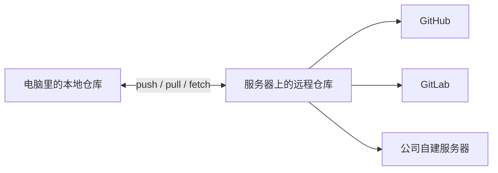
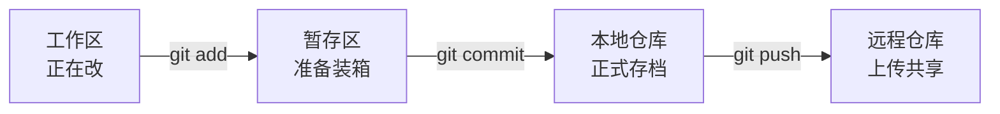

# Git 与 AI 协作：给代码一台“时光机”

> [!abstract] 一句话定位
> AI 可以让代码改得飞快，Git 负责让我们飞错方向时还能回得来。

本节不把 Git 讲成命令背诵大赛，而是带学员建立一张“我的代码现在在哪里”的地图。学完后，学员应该敢让 AI 帮忙改代码，也知道怎样在改坏时留下退路。

配套的第 5 课 HTML 课件说明：[[常州夜宵005-后端-API与数据库/slides-html/README|从网页到应用——后端 API 与数据库]]

## 一、为什么 AI 时代更要学 Git

先抛出一个小白最容易遇到的现场：

> 你跟 AI 说：“帮我把登录页做得高级一点。”
> AI 一口气改了 12 个文件。页面确实高级了，但登录按钮也不认识你了。

没有 Git 时，常见补救方式是：

- 疯狂按 `Command + Z`，祈祷撤销链没有断；
- 在文件夹里制造 `最终版`、`最终版2`、`最终版-真的不改了`；
- 回头问 AI：“你刚才到底改了什么？”

有了 Git，我们可以随时查看变化、保存节点、开辟试验分支，也可以让几个 AI 在不同工作区并行干活。

> [!tip] 课堂金句
> AI 是动力，Git 是刹车。只有动力没有刹车，那不叫效率，那叫新闻素材。

## 二、先分清 Git 和 GitHub

| 概念 | 小白版解释 | 生活比喻 | 没有网络能否使用 |
|---|---|---|---|
| Git | 安装在电脑上的版本管理工具 | 一台会记录每次改造的时光机 | 大多数本地操作可以 |
| Git 本地仓库 | 项目文件和完整的版本历史 | 你家的工作间，日记本也放在里面 | 可以 |
| 远程仓库 | 放在其他服务器上、可供备份与协作的 Git 仓库 | 团队共用的云端总仓库 | 访问时需要 |
| GitHub | 托管 Git 远程仓库并提供协作功能的平台 | 全球大型代码商场 + 协作大厅 | 需要 |

### 需要订正的一个小误区

Git 不是“本地仓库 + 云端仓库”的统称。更准确地说：

- Git 是分布式版本管理工具，本地就能保存完整历史；
- 远程仓库可以放在公司自己的服务器，也可以放在 GitHub、GitLab、Gitee 等平台；
- GitHub 是最知名的 Git 仓库托管与开发协作平台之一，但 Git 并不等于 GitHub。



## 三、必须建立的两张地图

### 地图 A：一次改动怎样变成一份正式存档



| 位置 | 比喻 | 你可以问的问题 |
|---|---|---|
| 工作区 | 厨房操作台 | 我刚改了哪些东西？ |
| 暂存区 | 打包台 | 这次准备把哪些变化装进箱子？ |
| 本地仓库 | 自家档案室 | 我已经正式保存了哪些版本？ |
| 远程仓库 | 云端总仓库 | 团队现在能看到哪些版本？ |

> [!important] Commit 不等于上传
> `git commit` 只是在本地留下存档；`git push` 才是把本地存档发到远程仓库。拍了照，不等于已经发朋友圈。

### 地图 B：Branch 和 Worktree 不是一回事

| 概念 | 它解决什么问题 | 比喻 |
|---|---|---|
| Branch（分支） | 让不同改动拥有独立的发展线 | 剧情的平行宇宙：主角可以同时尝试两个结局 |
| Worktree（工作树） | 让同一个仓库的多个分支同时出现在不同文件夹 | 给每个平行宇宙配一张独立工作台 |

关键结论：

- Branch 是一条版本线，不是额外复制出来的整个项目；
- 普通切换分支时，同一个工作目录的内容会跟着切换；
- Worktree 允许多个分支在多个文件夹中同时展开，特别适合“我在改页面，AI 在另一条分支写测试”的场景；
- 一个分支通常不能同时被两个 worktree 检出。

## 四、核心功能：每个只回答一个问题

| 功能 | 它回答的问题 | 典型命令 |
|---|---|---|
| 初始化 / 下载 | 这个项目怎样成为仓库？ | `git init`、`git clone` |
| 状态 | 我现在在哪条分支，改了什么？ | `git status` |
| 差异 | 改动前后具体差在哪里？ | `git diff`、`git diff --staged` |
| 选择改动 | 这次打算把什么放进存档？ | `git add <file>` |
| 本地存档 | 怎样给当前状态留一个可追溯节点？ | `git commit -m "..."` |
| 历史 | 过去保存过哪些节点？ | `git log --oneline --graph --decorate --all` |
| 并行试验 | 怎样在不影响主线的地方干活？ | `git switch -c <branch>` |
| 多工作区 | 怎样同时打开多条分支？ | `git worktree add ...` |
| 同步与共享 | 怎样看远程更新、合并更新、上传改动？ | `git fetch`、`git pull`、`git push` |
| 协作审核 | 怎样让别人检查后再进入主线？ | GitHub Pull Request |

## 五、45‑60 分钟课堂结构

| 时间 | 模块 | 核心内容 | 教学方式 |
|---|---|---|---|
| 0‑5 分钟 | AI 改坏代码了，怎么办？ | 从“最终版-真的最终”引出版本管理 | 故事 + 翻车截图 |
| 5‑12 分钟 | Git 不等于 GitHub | 本地仓库、远程仓库、托管平台 | 本地工作间与云端总仓库比喻 |
| 12‑22 分钟 | 一次改动的旅程 | 工作区、暂存区、Commit、Push | 现场改一行文字并存档 |
| 22‑30 分钟 | 平行宇宙 Branch | 建分支、切分支、合并概念 | 同一页面做两种配色 |
| 30‑38 分钟 | 分身工位 Worktree | 同一仓库、多个分支、多个目录 | 人和 AI 并行任务演示 |
| 38‑48 分钟 | 与 GitHub 同步 | Clone、Fetch、Pull、Push、PR | 用“收快递 / 拆快递 / 寄快递”区分 |
| 48‑55 分钟 | AI 协作安全流程 | 先看状态、再看差异、小步提交、审查后合并 | 教师完整演示 |
| 55‑60 分钟 | 挑战任务 | 学员完成一次安全改动 | 两人一组实操 + 复盘 |

> [!note] 45 分钟压缩方案
> 将 Worktree 压缩为 3 分钟概念演示，不让学员动手；将 Fetch 和 Pull 的底层关系放入课后延伸。

## 六、可直接照着演示的命令路线

### 演示 1：先学会看，再学会改

```bash
git --version
git status
git branch --show-current
git diff
git log --oneline -5
```

讲师提示：前四个都是以“看”为主的低风险命令。初学者不知道该做什么时，先跑 `git status`，就像迷路时先打开地图，不要立刻猛踩油门。

### 演示 2：做一次小而清楚的 Commit

```bash
git status
git diff
git add README.md
git diff --staged
git commit -m "docs: explain how to start the project"
git status
```

需要讲清的三件事：

1. `git add README.md` 是选中本次要提交的文件，不是保存文件；
2. `git diff --staged` 是在封箱前再看一眼箱子里装了什么；
3. Commit 信息要说明“这个存档做了什么”，不要只写 `update`、`fix`、`改一下`。

### 演示 3：给 AI 开一条独立分支

```bash
git switch -c feature/ai-login-page
git branch --show-current
git status
```

讲师台词：

> 现在我们进入了“AI 改登录页”的平行宇宙。它改得好，我们把结果合回主线；它把登录页改成了个人演唱会，我们就关闭这个宇宙。

### 演示 4：让人和 AI 拥有独立工作台

```bash
git worktree add ../project-ai -b feature/ai-tests
git worktree list
```

示意结构：

```text
project/      → 你在 main 或自己的功能分支上工作
project-ai/   → AI 在 feature/ai-tests 分支上工作
```

课堂只做“新建 + 查看”演示。删除 worktree 前要先确认其中没有未保存的改动，不把强制删除作为小白的首批命令。

### 演示 5：与 GitHub 对话

```bash
git remote -v
git fetch origin
git pull
git push -u origin feature/ai-login-page
```

三个快递比喻：

- `fetch`：快递员把远程最新清单送到了门口，还没有放进你家的家具布局；
- `pull`：收件后立即尝试把新东西合并到当前房间；
- `push`：把你本地已经 Commit 的包裹寄往远程。

> [!warning] 演示 `pull` 前先跑 `git status`
> 工作区有未保存改动时，不要一紧张就乱用“强制”命令。先搞清本地改了什么，再决定提交、暂存还是放弃。

## 七、AI 协作时的实用“指令”

这些不是 Git 命令，而是可以直接对 AI 助手说的任务指令。与其说“帮我处理一下 Git”，不如把权限、边界和验收方式说清楚。

### 安全巡检

```text
请只做读取检查：告诉我当前分支、工作区状态、未提交改动和最近 5 次 Commit。
不要修改文件，不要执行 commit、push、reset 或 clean。
```

### 改动前留退路

```text
请先检查 git status 和当前分支。
不要在 main 上直接修改；为这个任务创建独立分支，再开始工作。
保留我已有的未提交变更，如果可能冲突，先停下说明。
```

### 让 AI 帮你审稿，不是帮你闭眼按钮

```text
请检查当前 diff，按“功能错误、安全风险、无关改动、漏测试”四类进行审查。
先报告问题，未经我确认不要提交或推送。
```

### 准备 Commit 信息

```text
请根据已暂存的 diff 起草一条简洁的 Commit 信息。
如果一次提交混入了多个无关目标，先建议怎样拆分，不要直接 Commit。
```

## 八、小白第一天的命令卡

### 必须会：先掌握这 8 个

```bash
git clone <repository-url>       # 把远程仓库克隆到本地
git status                       # 看当前状态
git diff                         # 看尚未暂存的改动
git add <file>                   # 选择要放入本次提交的文件
git commit -m "message"          # 保存一个本地版本节点
git log --oneline                # 看历史存档
git pull                         # 取回并尝试合并远程更新
git push                         # 上传本地提交
```

### 理解就很加分

```bash
git switch -c <branch>           # 新建并切换到分支
git branch                       # 查看本地分支
git fetch origin                 # 取回远程信息，不直接合并
git remote -v                    # 查看远程仓库地址
git worktree list                # 查看所有工作树
```

### 知道它们很有力，不要随手乱用

```text
git reset --hard
git clean -fd
git push --force
git branch -D
```

这些命令可能丢失未保存工作、删除文件或改写共享历史。初学阶段看到 AI 建议使用它们时，应先问清：会影响哪些文件、是否可恢复、有没有更安全的做法。

## 九、课堂实操：给 AI 一个“可反悔”的任务

### 任务场景

让 AI 修改示例项目 README 的一段使用说明，学员完成以下流程：

1. 运行 `git status`，确认自己在哪个仓库、哪条分支；
2. 创建 `practice/ai-readme` 分支；
3. 让 AI 只修改指定段落；
4. 用 `git diff` 检查 AI 实际改了什么；
5. 只暂存指定文件，再用 `git diff --staged` 复核；
6. 创建一次语义清楚的 Commit；
7. 查看历史，用一句话说明自己刚刚保存了什么。

### 学员最终产出

- 一条独立分支；
- 一次可读、可追溯的 Commit；
- 一张记录 `status → diff → add → commit` 的流程卡；
- 一条能约束 AI 修改范围的任务指令。

## 十、备课时建议保留的课堂金句

1. **Git 是时光机，GitHub 是云端车站。**
2. **Commit 是存档，Push 是上传；拍照不等于发朋友圈。**
3. **Branch 是平行宇宙，Worktree 是给平行宇宙配的独立工作台。**
4. **看不懂时先 `git status`，要提交时先看 `git diff`。**
5. **一个 Commit 只讲一件事，像一张标题清楚的快递单。**
6. **AI 负责加速，人负责看路；提交前的 diff 就是后视镜。**

## 十一、课堂边界

### 本节必须讲清楚

- Git 与 GitHub 的区别；
- 工作区、暂存区、本地仓库和远程仓库的关系；
- Commit、Branch 和 Worktree 各自解决什么问题；
- AI 改动前留分支，改动后看 diff，提交前做检查。

### 本节只建立概念，不深挖

- Merge 和 Rebase 的底层差异；
- 复杂冲突解决；
- Git 对象模型、HEAD、游离状态等内部原理；
- 高级恢复、改写历史和强制推送。

> [!success] 本节真正的验收标准
> 学员不需要背出所有 Git 命令；他只要能说清“我在哪条分支、AI 改了什么、这次准备提交什么、是否已经上传”，就已经跨过了 Git 入门最重要的门槛。
